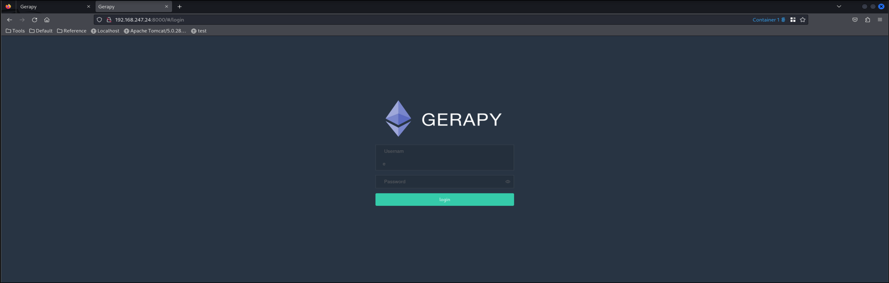
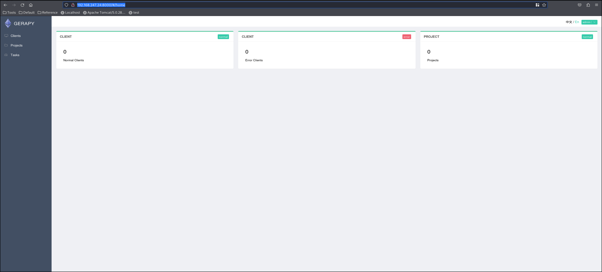
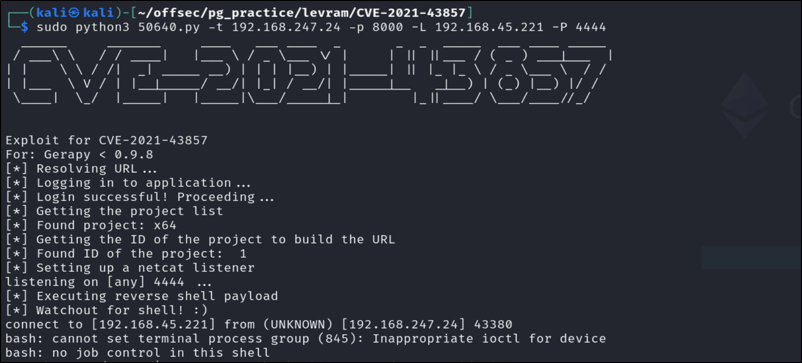
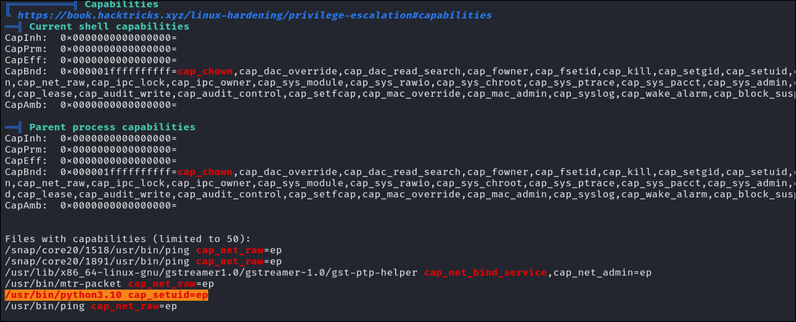
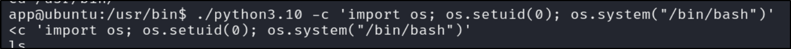
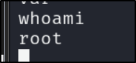

# PG Practice - Levram
## Machine Author: Offsec
## Released on: June 16, 2023
### Difficulty: Easy
### Community Difficulty: Easy
### Description: Part 3 of Mid Year CTF machines.
### Write up - Kaib3r
### Completion date - 30/03/2024


#### Introduction:

This was my third completed machine in Proving grounds without checking a write up, easy difficulty machine and in the end found it was very easy. I had the user flag very quickly but the privilege escalation was the hard part where I took advantage of some root level capabilities my user had.

The basic steps I took are below.

| Step: | Notes: |
| --- | --- |
| 1. | I ran a all ports nmap scan without a T4 switch to get started, a vuln script nmap scan and a scan for speed to start enumerating with a T4 switch and of only common ports. |
| 2. | My fast NMAP scan found port 8000 opened for http with a application installed called gerapy. |
| 2.1 |  |
| 3. | I out of habit tried default admin credentials and got in. |
| 3.1 |  |
| 4. | Found the version for the gerapy application and decided I'd run a quick search for vulnerabilities. |
| 4.1 |  |
| 5. | Found a GitHub from a person by the name of LongWayHomie and decided to give it a go. |
| 5.1 |  |
| 6 | Transferred over Linpeas and found a capability available to the user that ran as root, lucky for my python3. |
| 6.2 |  |
| 7. | Ran a neat line of Python to escalate to root in the shell. |
| 7.2 | Code: ```/usr/bin/python3.10 -c 'import os; os.setuid(0); os.system("/bin/bash")' <c 'import os; os.setuid(0); os.system("/bin/bash")'``` |
| 7.3 |  |
| 8. | Easy clap, the machine is pwned. |
| 8.1 |  |

|  Lessons Learnt: |  |
| --- | --- |
| 1. | Capabilities are very helpful when attempting to priv esc in a Linux system. |
| 2. | Change default credentials!! |
| 3. | Patch applications regularly. |
